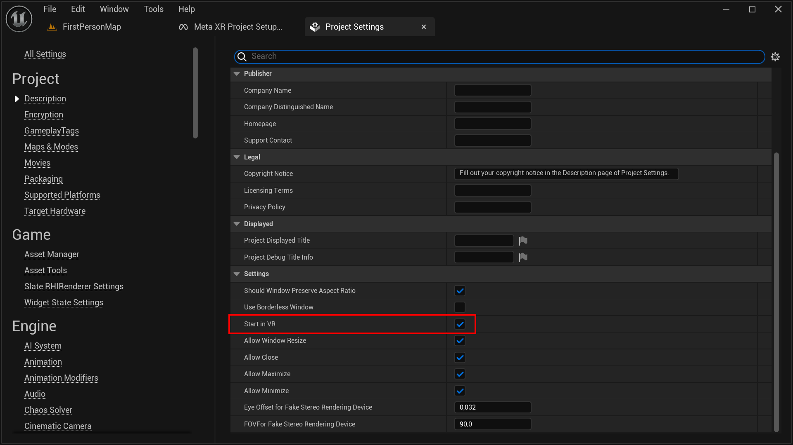
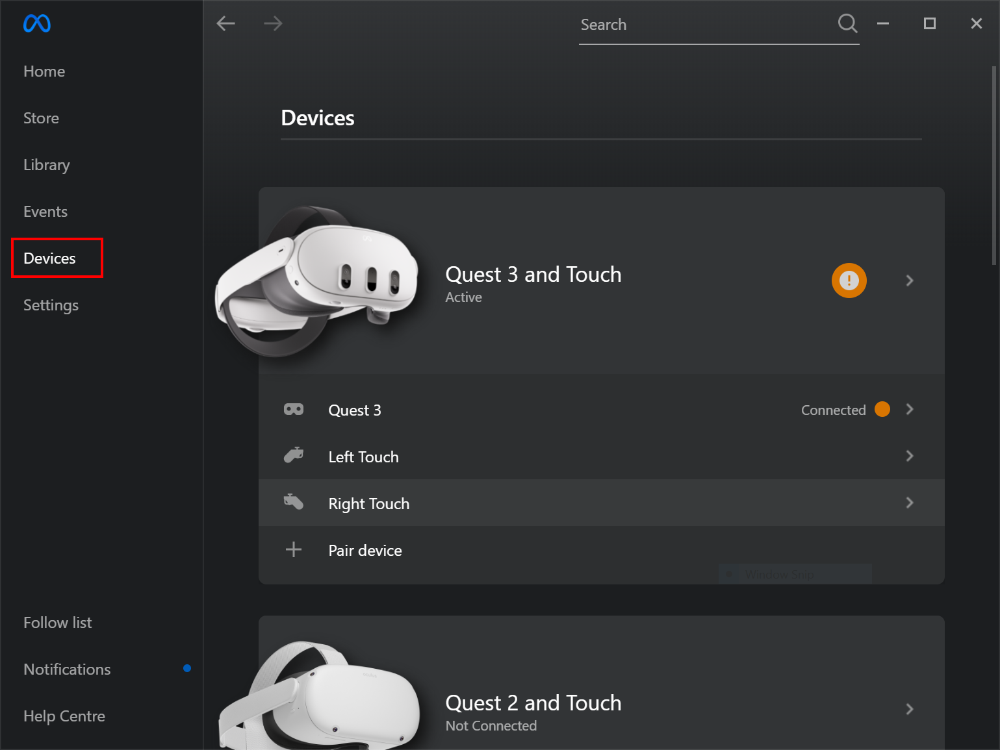
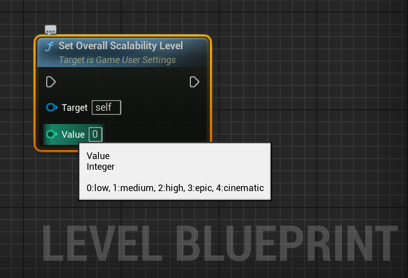
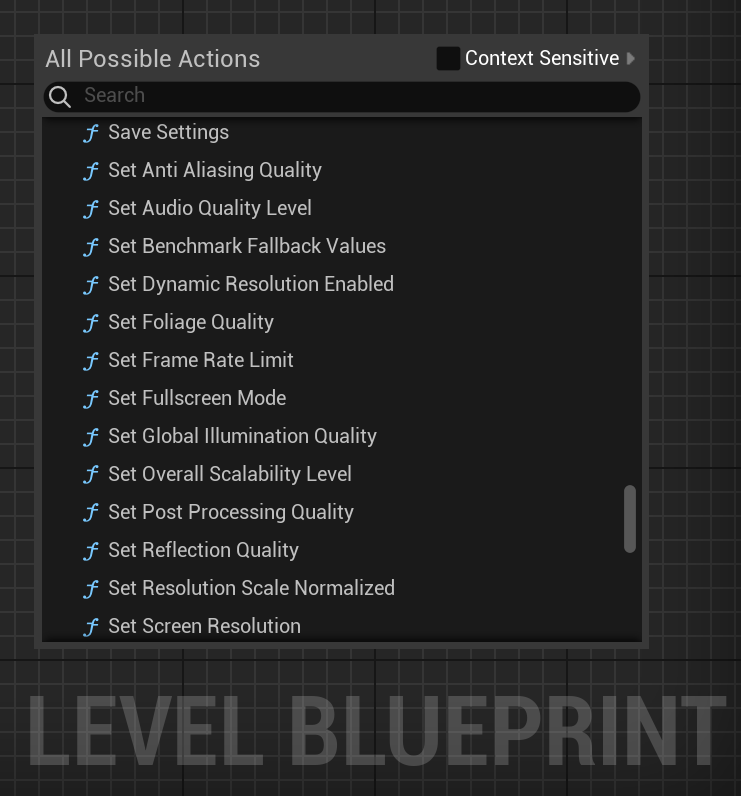
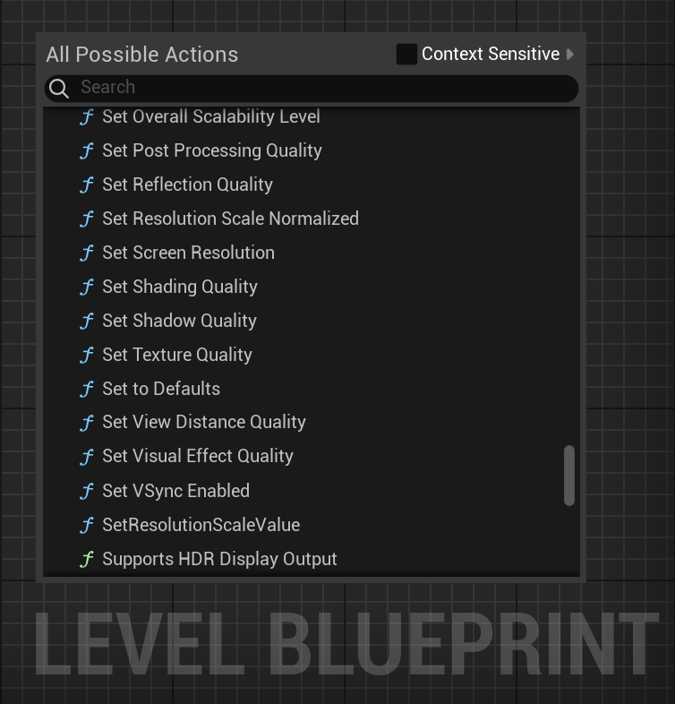
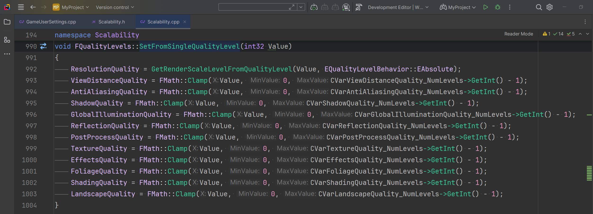
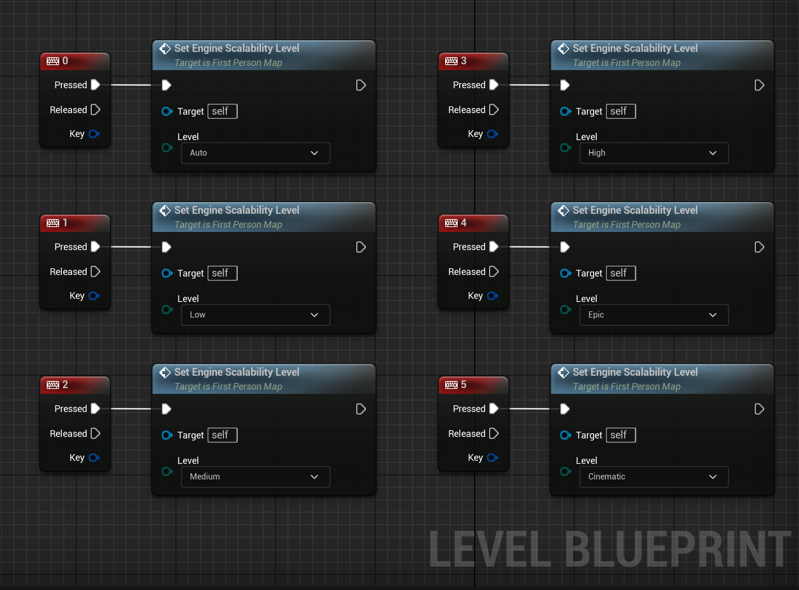
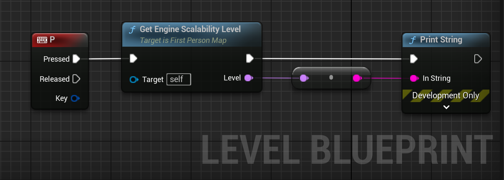
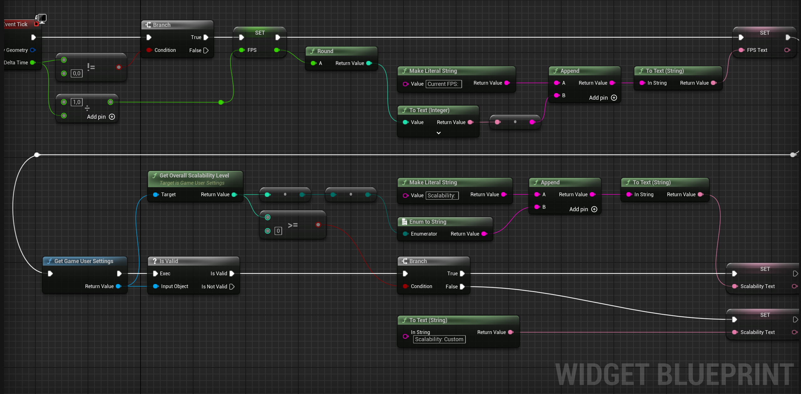

+++
title = "Optimizing Unreal Engine VR Projects for Higher Framerates (Meta Quest Tips Included!)"
slug = "optimizing-unreal-engine-vr-projects-higher-framerate"
date = 2025-01-08T03:36:00+01:00
tags = [ "AMD", "Android", "Blueprint", "DLSS", "Epic Games", "Frame Generation", "FSR", "Game Development", "Game Programming", "gamedev", "HTC VIVE", "Meta Quest", "NVIDIA", "Oculus", "Oculus Quest", "OpenXR", "Optimization", "PCVR", "UDK", "UE4", "UE5", "Unreal Engine", "UnrealScript", "Upscaling", "Virtual Reality", "VR", "Windows", "XR" ]
toc = true
+++



Ever felt like your VR project is running so slow it could be a snail's day job? 🐌 Or maybe your framerate is auditioning for a role in The Matrix—dodging bullets, but also every performance standard? 😅

Well, today, we're fixing that! I’ll show you how to take your Unreal Engine VR game from ‘meh’ to chef’s kiss smooth. Although enhancing the performance and framerate of Unreal Engine VR applications, whether running in standalone mode (Android mobile) or PCVR mode (PC streaming), can feel daunting, especially when dealing with varying project requirements, this guide breaks down practical and easy-to-implement strategies that deliver noticeable results with minimal hassle, helping you achieve smoother gameplay.

So, let’s get started before that snail finishes its coffee break!

<!--more-->

## English Video Tutorials

- The video tutorial:

 

## Proof: Optimized VR Project with 120+ FPS on Cinematic Quality Level



### Enhanced Visuals and Boosted Performance Utilizing NVIDIA DLSS



## Converting Non-VR Projects to Immersive VR

To convert a non-VR project into an immersive VR experience, the first step is to enable the `Start in VR` option in your project settings:

## PCVR Mode

Here are some crucial guidelines that you might consider adjusting to optimize performance in PCVR mode.

### Enhancing Meta Quest Link Graphics Settings

The default refresh rate is set at `72 Hz` when streaming from a PC to Meta Quest devices. However, you can increase this up to `120 Hz`, which enhances the refresh rate and reduces the rendering resolution, potentially improving performance. Follow these steps to adjust refresh rate:

1. Open the **Meta Quest Link** app and go to the `Devices` tab.

2. Select the device you want to adjust the refresh rate for.

3. In the device settings, navigate to the `Advanced` section and click on `Graphics Preferences`.

4. Select your preferred refresh rate, such as `120 Hz`. Once selected, click `OK` to confirm, and the Meta Quest Link app will automatically restart to apply the changes.

5. After the Meta Quest Link app restarts, revisit the `Devices` tab, select your device, and verify the refresh rate setting in `Advanced > Graphics Preferences`.

6. Next, open your Unreal Engine project and go to `Project Settings` to fine-tune your project’s framerate. Under `Engine > General Settings > Framerate`, adjust and experiment with the framerate settings to suit your project's specific needs.

## Standalone Mode (Mobile)

Optimizing performance for mobile platforms requires careful attention to specific settings. Here are some essential adjustments to maximize performance and efficiency for mobile devices.

---

### Generic Rendering Settings

**Forward Shading**: Enable Forward Shading for improved efficiency. It’s optimized for mobile platforms.

 - Rendering Settings - Forward Shading")

 - Rendering Settings - Mobile Shading")

**Mobile HDR**: Disable this option to conserve resources. HDR can have a significant performance impact, especially on lower-end devices.

 - Rendering Settings - VR")

**Instanced Stereo**: Activate this setting to streamline rendering by reducing the workload for VR applications, where two slightly different images are needed for each eye.

 - Rendering Settings - Instanced Stereo")

**Mobile Multi-View**: Enable this feature for optimized VR rendering on mobile devices, especially when using platforms like Google Daydream or Samsung Gear VR.

 - Rendering Settings - Mobile Multi-View")

**Mobile Anti-Aliasing Method**: Choose `FXAA (Fast Approximate Anti-Aliasing)` or `MSAA (Multisample Anti-Aliasing)` for smoother visuals. `MSAA` offers better quality with minimal performance impact.

 - Rendering Settings - Mobile Anti-Aliasing Method")

**Reflection Capture Resolution**: Lower the resolution (e.g., 128 or 256) to save memory.

 - Rendering Settings - Reflection Capture Resolution")

---

### Texture Settings

**Enable Virtual Texture Support**: Turn this setting off for better performance. See the [Virtual Texturing documentation](https://dev.epicgames.com/documentation/en-us/unreal-engine/virtual-texturing-in-unreal-engine) for more details.

 - Rendering Settings - Enable Virtual Texture Support")

**Texture Streaming**: Enable texture streaming to load textures progressively, reducing memory usage. See the [Texture Streaming documentation](https://dev.epicgames.com/documentation/en-us/unreal-engine/texture-streaming-in-unreal-engine) for more details.

 - Rendering Settings - Texture Streaming")

**Texture Quality**: Adjust to Medium or Low, depending on the capabilities of the target device.

**Texture Compression**: Use **ASTC** compression for Android devices to ensure optimized texture performance.

---

### Lighting Settings

**Static Lighting**: Use static lighting instead of dynamic lighting to save processing power.

**Lightmap Resolution**: Opt for lower lightmap resolutions (e.g., 32 or 64) to minimize memory usage.

**Dynamic Shadows**: Disable or reduce dynamic shadows. If necessary, use Cascaded Shadow Maps (CSM) with reduced resolution and range.

**Distance Field Shadows/Ambient Occlusion**: Turn these features off as they are resource-intensive.

 - Rendering Settings - Ambient Occlusion")

---

### Post-Processing Settings

**Bloom, Lens Flares, and Auto Exposure**: Minimize or disable these effects to save resources.

 - Rendering Settings - Bloom")

 - Rendering Settings - Lens Flares")

 - Rendering Settings - Auto Exposure")

**Screen Space Reflections**: Turn this off to reduce performance strain.

**Motion Blur**: Disable to conserve processing power.

 - Rendering Settings - Motion Blur")

---

### Materials and Shaders

**Material Complexity**: Simplify materials by minimizing instructions and limiting textures or shader nodes.

**Specular Highlights**: Reduce or disable to optimize performance.

**LOD (Level of Detail) Models**: Ensure models have LODs configured, reducing polygon count for distant objects.

---

### Level of Detail (LOD) Settings

**Mesh LODs**: Configure all meshes with appropriate LODs to reduce polygons as objects move further away.

**Screen Size**: Adjust LOD screen size settings to ensure efficient transitions for mobile devices.

---

### Engine Scalability Settings

**Resolution Scale**: Lower the scale (e.g., 70% or 80%) for a balance of quality and performance.

**View Distance**: Set to Medium or Low to reduce detail rendered at long distances.

**Shadows**: Lower or disable shadow quality to improve performance.

**Textures**: Adjust to Medium or Low depending on the device’s capability.

**Effects**: Minimize effects to conserve resources.

_**NOTE**_: In PCVR mode, Unreal Engine typically defaults the Engine Scalability Settings profile to `Epic`. However, when deploying to Standalone mode (Android), it switches to a custom profile. For more details, refer to [Game User Settings and Engine Scalability Settings](#game-user-settings-and-engine-scalability-settings).

---

### Physics and Collision

**Physics Simulation**: Limit physics calculations where possible to save resources.

**Collision Complexity**: Use simple collision meshes instead of complex ones.

---

### Audio Settings

**Sample Rate**: Lower the sample rate to reduce memory and processing load.

**Number of Audio Channels**: Restrict the number of channels to optimize CPU usage.

---

### Rendering API

**Vulkan vs OpenGL ES**: Test both APIs on your target device. Vulkan typically offers better performance but may not be supported universally.

---

### Culling

Unreal Engine utilizes [several types of culling mechanisms to optimize rendering](https://dev.epicgames.com/documentation/en-us/unreal-engine/visibility-and-occlusion-culling-in-unreal-engine#precomputedvisibility) by avoiding unnecessary calculations for objects that are not visible or relevant. Here’s an overview of the primary culling types and other specialized techniques offered by Unreal Engione to ensure optimal rendering performance based on the order they are applied (the order depends on their cost):

[**Distance Culling**](https://dev.epicgames.com/documentation/en-us/unreal-engine/visibility-and-occlusion-culling-in-unreal-engine#distance): Distance culling methods, such as [Per-Actor Instance](https://dev.epicgames.com/documentation/en-us/unreal-engine/visibility-and-occlusion-culling-in-unreal-engine#per-actorinstance) (individual draw distance settings per Actor) and [Cull Distance Volumes](https://dev.epicgames.com/documentation/en-us/unreal-engine/visibility-and-occlusion-culling-in-unreal-engine#culldistancevolumes) (arrays of sizes and distances for large levels), control whether Actors are rendered based on their distance from the camera, optimizing performance by not rendering Actors that are too far away.

[**View Frustum Culling**](https://dev.epicgames.com/documentation/en-us/unreal-engine/visibility-and-occlusion-culling-in-unreal-engine#viewfrustum): Avoids rendering objects outside the camera's view frustum (the visible area of the camera). Only objects within this space, defined by the camera's field of view (FOV) and bounded by near and far clipping planes, are processed for rendering. Objects outside are ignored to save processing time. This feature is enabled by default.

[**Precomputed Visibility Culling**](https://dev.epicgames.com/documentation/en-us/unreal-engine/precomputed-visibility-volumes-in-unreal-engine): Precomputed Visibility Volumes store the visibility state of non-movable Actors in cells above shadow-casting surfaces. Generated offline during lighting builds, this method is ideal for small to medium-sized levels and works well on lower-end hardware and mobile devices. It trades expensive rendering thread costs for more manageable runtime memory usage, offering better performance flexibility on constrained systems.

[**Dynamic Occlusion Culling**](https://dev.epicgames.com/documentation/en-us/unreal-engine/visibility-and-occlusion-culling-in-unreal-engine#dynamicocclusion): Occlusion culling hides objects blocked by other objects within the camera's view, improving performance in dense scenes. It offers several methods ([Hardware Occlusion Queries](https://dev.epicgames.com/documentation/en-us/unreal-engine/visibility-and-occlusion-culling-in-unreal-engine#hardwareocclusionqueries), [Hierarchical Z-Buffer Occlusion](https://dev.epicgames.com/documentation/en-us/unreal-engine/visibility-and-occlusion-culling-in-unreal-engine#hierarchicalz-bufferocclusion), and [Round Robin Occlusion for VR](https://dev.epicgames.com/documentation/en-us/unreal-engine/visibility-and-occlusion-culling-in-unreal-engine#roundrobinocclusionforvr)) to track visibility states of Actors within the view frustum, issuing GPU or CPU queries to determine if objects are occluded.

Hardware Occlusion Queries are enabled by default and supported on platforms with **OpenGL ES 3.1** or higher (**iOS**) or **Vulkan** (**Android**), including some high-end mobile devices. To ensure occlusion culling skips rendering objects blocked by others, you can enable or adjust the following methods:

- **Hardware Occlusion Queries**: Enable this in `Project Settings > Rendering > Culling` by checking `Occlusion Culling`, or set the `r.AllowOcclusionQueries` console variable to `1` in the device config file.

 - Rendering Settings - Occlusion Culling")

- **Hierarchical Z-Buffer Occlusion**: Enable HZB by setting the `r.HZBOcclusion` console variable to `1`.

- **Round Robin Occlusion for VR**: Activate this for VR in the `.ini` config file, or at runtime using the `vr.RoundRobinOcclusion` console variable set to `1`.

__NOTE__: Additional culling options, such as **Light Culling**, **Volumetric Fog Culling**, and **Custom Code-driven Culling Rules** can be tweaked and fine-tuned in Unreal Engine for optimal performance.

__NOTE__: Unreal Engine provides various console commands for inspecting culling, including the [stat initviews](https://dev.epicgames.com/documentation/en-us/unreal-engine/visibility-and-occlusion-culling-in-unreal-engine#performancestatistics), [FreezeRendering](https://dev.epicgames.com/documentation/en-us/unreal-engine/visibility-and-occlusion-culling-in-unreal-engine#freezingrenderingofthescene), and [r.VisualizeOccludedPrimitives](https://dev.epicgames.com/documentation/en-us/unreal-engine/visibility-and-occlusion-culling-in-unreal-engine#visualizingoccludedactors) commands.

## Additional Optimization Measures

### Meta XR Plugin

The [Meta XR Unreal Engine Plugin](https://developers.meta.com/horizon/downloads/package/unreal-engine-5-integration/) includes a built-in **Project Setup Tool** to help optimize Unreal Engine projects for VR.

Once opened, the tool displays all tweakable project settings across multiple tabs, regardless of their optimization status. It categorizes these settings into four sections: **Required Rules**, **Recommended Rules**, **Applied Rules**, and **Ignored Rules**.

")

")

")

")

")

You can apply the required or recommended rules individually by clicking the `Apply` button next to each rule, or apply all rules in a section by using the `Apply All` button. Multiple presses of the `Apply All` button may be necessary to ensure all rules are applied. After applying the rules, the tool will prompt you to restart the editor for the changes to take effect.

")

After restarting, verify that all the rules in the Project Setup Tool across all tabs are applied. Occasionally, some rules may not take effect across the editor restarts, requiring you to repeat the process and restart the editor multiple times to correctly apply the changes.

")

### Game User Settings and Engine Scalability Settings

Unreal Engine offers predefined graphics quality profiles called [**Engine Scalability Settings**](https://dev.epicgames.com/documentation/en-us/unreal-engine/scalability-in-unreal-engine) to help you optimize performance effortlessly. These settings can be modified directly in the Unreal Editor through the Settings menu on the toolbar or dynamically during runtime using code. Importantly, these settings are universal—changes made in the Unreal Editor affect the game in PIE (Play In Editor) mode, while adjustments via code also influence the editor itself.

The available engine scalability levels are `Low`, `Medium`, `High`, `Epic`, and `Cinematic`. When setting the Engine Scalability Level through the Unreal Editor, you can create a `Custom` Engine Scalability Level by configuring individual quality settings as well. Additionally, you can let Unreal Engine determine the optimal settings by performing a hardware benchmark via the `Auto` button.

In Unreal Engine, you can specify the Engine Scalability Level using C++ or the Blueprint function `Set Overall Scalability Level`. You can also retrieve the current level with the `Get Overall Scalability Level` function.

The `Get Overall Scalability Level` function returns the following numerical values to indicate the current scalability level:

- `-1`: Indicates the current Engine Scalability Level is set to `Custom`.
- `0`: Indicates the current Engine Scalability Level is set to `Low`.
- `1`: Indicates the current Engine Scalability Level is set to `Medium`.
- `2`: Indicates the current Engine Scalability Level is set to `High`.
- `3`: Indicates the current Engine Scalability Level is set to `Epic`.
- `4`: Indicates the current Engine Scalability Level is set to `Cinematic`.

The `Set Overall Scalability Level` function takes a `Value` parameter of type `Integer`, which defines the desired scalability level as follows:

- `0`: Sets the Engine Scalability Level to `Low`.
- `1`: Sets the Engine Scalability Level to `Medium`.
- `2`: Sets the Engine Scalability Level to `High`.
- `3`: Sets the Engine Scalability Level to `Epic`.
- `4`: Sets the Engine Scalability Level to `Cinematic`.

Just like the Unreal Editor or C++, you can configure custom scalability levels in Blueprint by individually adjusting each relevant setting. This can be done using the corresponding Blueprint functions in the `Settings` actions category of the Blueprint Editor's context menu.

In fact, examining the C++ source code for the `SetFromSingleQualityLevel` function—used by the `Set Overall Scalability Level` Blueprint function—reveals that it calls the individual quality settings functions. This occurs when you select a scalability level in the Unreal Editor or set it through Blueprint code.

We can use the following Blueprints to bind keys `1` to `5` to switch between scalability levels from `Low` to `Cinematic`:

We can also use the following Blueprints to bind key `0` to perform a hardware benchmark and determine the optimal scalability level automatically:

It’s possible to simplify the above Blueprints by converting the above code into a Blueprint function, for example, `Set Engine Scalability Level`:

")

Also, in order to utilize the above function and avoid memorizing numerical values instead of scalability level names, we can define an `EngineScalabilitySettings` enumeration in Unreal Engine with the following enum names mapped to the following numerical values:

- `Low`: Evaluates to `0`.
- `Medium`: Evaluates to `1`.
- `High`: Evaluates to `2`.
- `Epic`: Evaluates to `3`.
- `Cinematic`: Evaluates to `4`.
- `Custom`: Evaluates to `5`.
- `Auto`: Evaluates to `6`.

In any case, you can see the implementation of `Set Engine Scalability Level` in more detail in the following screenshots:

")

")

")

Now using the above `Set Engine Scalability Level` function and `EngineScalabilitySettings` enum, the simplified Blueprint code for performing the hardware benchmark or setting the engine scalability levels looks like this:

In a similar fashion, we can define a `Get Engine Scalability Level` function, which can be used to retrieve the name of the current engine scalability level instead of the numerical values:

And then we can utilize it like this to print the engine scalability level name on screen and inside the engine logs:

Even better, we can implement a 3D Blueprint Widget using the following Blueprint implementation to display the current Engine Scalability Level and the real-time FPS on a widget inside our level:

### NVIDIA DLSS

Consider utilizing [NVIDIA Deep Learning Super Sampling (DLSS)](https://developer.nvidia.com/rtx/dlss/get-started) which is a technology developed by NVIDIA that leverages artificial intelligence (AI) to upscale lower-resolution images into higher-resolution visuals in real-time while maintaining or enhancing visual fidelity. Using dedicated Tensor Cores on NVIDIA's RTX GPUs, DLSS employs deep neural networks to reconstruct images with detail and sharpness that rivals native rendering. This process reduces the computational load on the GPU, allowing for higher frame rates without significant sacrifices in visual quality. DLSS is exclusive to NVIDIA hardware, specifically GeForce RTX cards starting from the RTX 2000 series and newer.

### AMD FSR

Consider utilizing [AMD FidelityFX Super Resolution (FSR)](https://gpuopen.com/learn/ue-fsr3/) which is AMD's upscaling technology designed to boost frame rates by rendering games at a lower resolution and upscaling them to a higher resolution using a spatial or temporal upscaling algorithm. Unlike NVIDIA DLSS, FSR does not require specialized AI hardware, making it compatible with a broader range of GPUs, including AMD Radeon GPUs (from RX 400 series and newer), select NVIDIA GPUs (GeForce GTX 10 series and newer), and even some integrated GPUs. This wide compatibility is due to its hardware-agnostic nature, enabling developers to implement FSR across a wide array of platforms.
